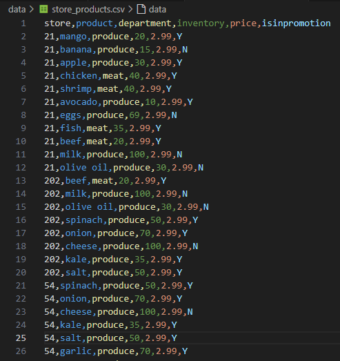
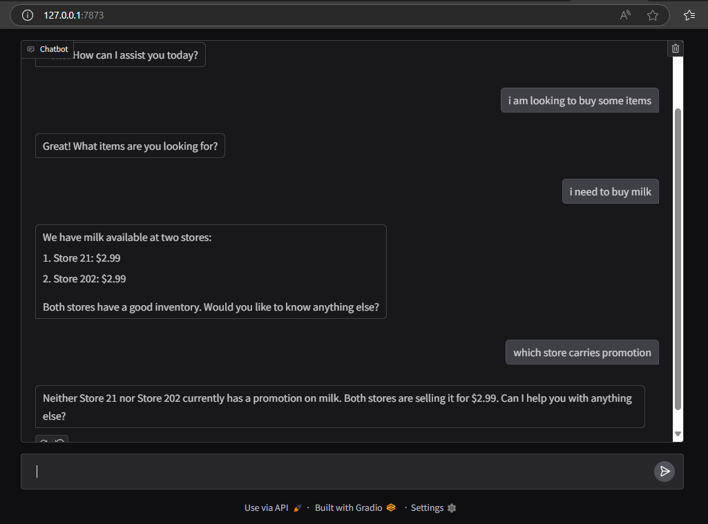
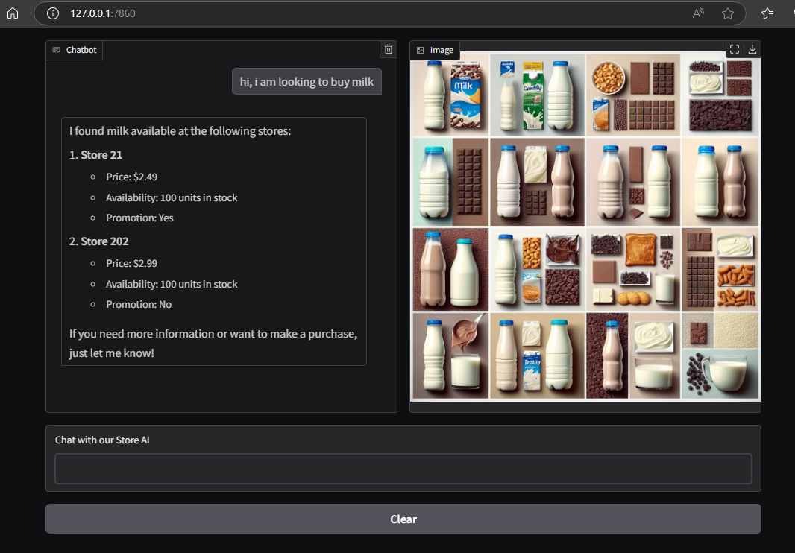
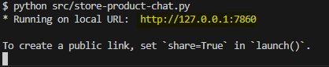

<h1 align="center"># AI chat for Retail chain </h1>
This is a baseline for an AI project / product for retail industry

The AI is trained to look through the store inventory system and respond to chat

I have used Gradio as the UI interface for the chat system while the underlying LLM model can be anything. I have used gpt-40-mini in my case.

The store product data is fed from a csv file and can be replaced by a DB or some service feed

<p align="center">
    
</p>

## Simple Chat
The `chat` function takes the user's message prompts and processes the LLM invocation to respond to the user's message
The `tool_call` is handled by `handle_tool_call` method which calls the custom method to get the product details for the inquired product 

```python
    def chat(self, message, history):
        """
        method with signature appropriate to be used for Gradio chat interface
        """
        messages = [{"role": "system", "content": self.system_message}] + history + [{"role": "user", "content": message}]
        response = self.openai.chat.completions.create(model=self.MODEL, messages=messages, tools=self.tools, tool_choice="auto")
        
        if response.choices[0].finish_reason=="tool_calls":
            message = response.choices[0].message
            response = self.handle_tool_call(message)
            messages.append(message)
            messages.append(response)
            response = self.openai.chat.completions.create(model = self.MODEL, messages=messages)
                            
        return response.choices[0].message.content

```

Above chat method is configured to capture the interaction through the simple Gradio's ChatInterface method.

```python
    gr.ChatInterface(fn=StoreProductChat().chat, type="messages").launch()
```

<p align="center">
    
</p>

## Chat with Image Agent
This `chat` extends simple chat to involve an image agent such as dall-e-3 where the custom `tool_calls` will invoke the image
agent to generate a collage image for the items in a store. 

```python
    def chatWithImage(self, message, history):
        """
        same as chatSimple but with image agent added

        Parameter(s):
        message: latest prompt message from the user
        history: history of the user and LLM call messages
        
        Returns:
        message: empty string to clear the last typed messaged by the user
        history: history of the chat communication for the AI calls
        image : image output generated by PictureAgent 
        """        
        response, toolCallResponse = self.chat(message, history)
        image = None
        
        if toolCallResponse is not None and toolCallResponse.get('content') is not None:
            content_str=toolCallResponse.get('content')
            product_info = json.loads(content_str)['product_info']
            
            if product_info !='unknown':
                
                # Get the product items from the list of dictionary
                product_items= [item.get('product') for item in product_info if item.get('product')]

                # Invoke image generation AI method
                image = PictureAgent().generateImage(product_items)
        
        history += [{"role": "user", "content": message}, {"role": "assistant", "content": response}]
        return "", history, image
```

The gradio interface is modified to accomodate image generated by the image agent and shows as below.
<p align="center">
    
</p>


## Setup
You need to create a virtual env and install the packages listed in `requirements.txt`.
Follow these steps: [How to Work with Python Virtual Environments, Jupyter Notebooks and VS Code](https://python.plainenglish.io/how-to-work-with-python-virtual-environments-jupyter-notebooks-and-vs-code-536fac3d93a1).

You need to create a `.env` file with the below entries (just modify value for `OPENAI_API_KEY` to reflect your OpenAI Api key).
```
OPENAI_API_KEY="sk-proj-xxxxxxxxxxxxxxxxxxxxxxxxx"
OPENAI_MODEL='gpt-4o-mini'
STORE_PRODUCTS_FILE = "store_products.csv"
```

## Usage
To run the tool:
```
cd src
python store-product-chat.py
```
Navigate to the local `url` displayed and start chatting


