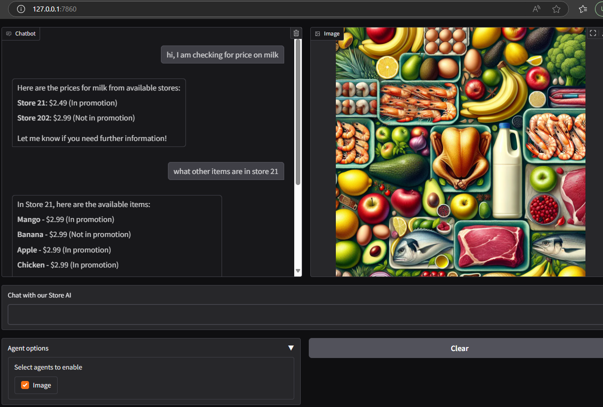

<h1 align="center"># AI chat for Retail chain </h1>
This is a baseline for an AI project / product for retail industry

The AI is trained to look through the store inventory system and respond to chat

I have used Gradio as the UI interface for the chat system while the underlying LLM model can be anything. I have used gpt-4o-mini in my case.

The store product data is fed from a csv file and can be replaced by a DB or some service feed

<p align="center">
    
</p>

## Simple Chat
The `chat` function takes the user's message prompts and processes the LLM invocation to respond to the user's message
The `tool_call` is handled by `handle_tool_call` method which calls the custom method to get the product details for the inquired product 

```python
    def chat(self, message, history):
        """
        method with signature appropriate to be used for Gradio chat interface
        """
        messages = [{"role": "system", "content": self.system_message}] + history + [{"role": "user", "content": message}]
        response = self.openai.chat.completions.create(model=self.MODEL, messages=messages, tools=self.tools, tool_choice="auto")
        
        if response.choices[0].finish_reason=="tool_calls":
            message = response.choices[0].message
            response = self.handle_tool_call(message)
            messages.append(message)
            messages.append(response)
            response = self.openai.chat.completions.create(model = self.MODEL, messages=messages)
                            
        return response.choices[0].message.content

```

Above chat method is configured to capture the interaction through the simple Gradio's ChatInterface method.

```python
    gr.ChatInterface(fn=StoreProductChat().chat, type="messages").launch()
```

<p align="center">
    
</p>

## Chat with Image Agent
This `chat` extends simple chat to involve an image agent such as dall-e-3 where the custom `tool_calls` will invoke the image
agent to generate a collage image for the items in a store. 


The gradio interface is modified to enable optional image agent which displays image generated by LLM as shown below.
<p align="center">
    
</p>

## Setup
You need to create a virtual env and install the packages listed in `requirements.txt`.
Follow these steps: [How to Work with Python Virtual Environments, Jupyter Notebooks and VS Code](https://python.plainenglish.io/how-to-work-with-python-virtual-environments-jupyter-notebooks-and-vs-code-536fac3d93a1).

You need to create a `.env` file with the below entries (just modify value for `OPENAI_API_KEY` to reflect your OpenAI Api key).
```
OPENAI_API_KEY="sk-proj-xxxxxxxxxxxxxxxxxxxxxxxxx"
OPENAI_MODEL='gpt-4o-mini'
STORE_PRODUCTS_FILE = "store_products.csv"
```

## Usage

To install required packages:
```
pip install -r requirements.txt
```

To run the tool:
```
cd src
python store-product-chat.py
```
Navigate to the local `url` displayed and start chatting


### setup via uv
If using uv as python package manager, run below command to restore packages from requirements.txt
```
uv pip install -r requirements.txt
```
and then to run the tool, use
```
uv run ./src/store-product-chat.py
```
